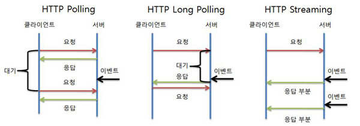

# socketio

## socketio 란

Web은 브라우저에서 Request를 보내면 서버에서 Response를 보내주는 방식으로 구현이 되었다. 사용자가 많아지고 계속적으로 연결을 하는 니즈가 발생하고 이는 long polling, Stream 방식과 같이 단방향 방법을 변형하여 사용하였다. 
그러다 html5에서 websocket 기술이 나타났다. 이는 신기술이고 지원하는 브라우져가 있고 지원하지 않는 브라우져가 있다.
socketio는 브라우져의 버전을 확인하여 websocket이 지원하면 websocket 지원하지않으면 long polling 방법, 안되면 Stream 방법을 구분하여 서버와 양뱡향으로 통신할 수 있게 해주는 모듈이다. 

socketio는 자바스크립트로 개발이 시작되었다.

### Polling & Long Polling & Streaming

Polling : 클라이언트가 지속적으로 서버로  request를 하여 이벤트를 수신하는 방식이다. 가장 간단한 방법이지만, 지속적으로 서버에 요청을 던지기 때문에 서버 부하를 신경써야한다.

Long Polling: polling에서 발전한 버전이다. 클라이언트에서 요청을 하게되면 서버에서 대기하다가 이벤트가 발생하면 응답을 보낸다. 클라이언트는 이벤트를 받기 전까지 다음 요청을 날리지 않는다. 
실시간 반응이 가능하고 polling에 비해서 불필요한 트래픽은 유발하지는 않지만 오히려 이벤트가 잦다면 순간적으로 과부하가 걸리게 된다.

Streaming: 서버는 클라이언트로부터 request를 받으면, response을 주고 연결을 끊지 않고. 이벤트가 발생함에 따라 클라이언트로 전송하는 방식이다. 연결 시간이 길어질수록 연결의 유효성 관리의 부담이 발생한다.

websocket: 처음 연결을 하면 양방향으로 원할때 요청을 보낼 수 있으며 stateless한 HTTP에 비해 오버헤드가 적으므로 유용하게 사용할 수 있다. 비정상적으로 연결이 끊어졌을때를 대비해야하며 socket을 연결하는것이 비용이 많이 발생한다. 

## python 에서 어떤 모듈을 사용할 것인가

python 에서 socketio를 사용하기 위해서는 크게 두가지 모듈이 있다. 

- flask-socketio(https://github.com/miguelgrinberg/Flask-SocketIO)
- python-socketio(https://github.com/miguelgrinberg/python-socketio)

둘다 같은 사람이 운영하고있으며 flask-socketio의 좋아요수와 fork 수가 많기에 레퍼런스도 많을거라 생각되어 flask-socketio를 사용하고자한다. 둘중 어느것을 사용하더라도 크게 차이는 없다고한다. (https://github.com/miguelgrinberg/python-socketio/issues/279)

## flask-socketio

eventlet

gevent

The Flask development server based on Werkzeug

위 세가지는 단순히 네트워크 모듈의 차이일뿐

웹서버를 여러개 돌릴 수 있는 방법을 찾아보자.

sticky session

서버가 여러대일때 A라는 서버만 세션 정보를 가지고 있으면 B라는 서버에 접속하였을 경우 로그아웃이 되는 현상이 발생할 수 있다. 
특정 사용자가 접속을 시도 했을때 처음 접속된 서버로 계속해서 접속되도록 트래픽을 처리하는 방식

궁금증

streaming 과 websocket은 비슷한것 아닌가? 차이점이 무엇인지 찾아보기

참고

- https://d2.naver.com/helloworld/1336
- https://flask-socketio.readthedocs.io/en/latest/
- https://swiftymind.tistory.com/105

앞으로 공부해야할것

https://www.slideshare.net/SangwonPark8/elb-socketio-85188497?qid=ecd4b045-66db-4dcd-adfb-a632517945ad&v=&b=&from_search=24